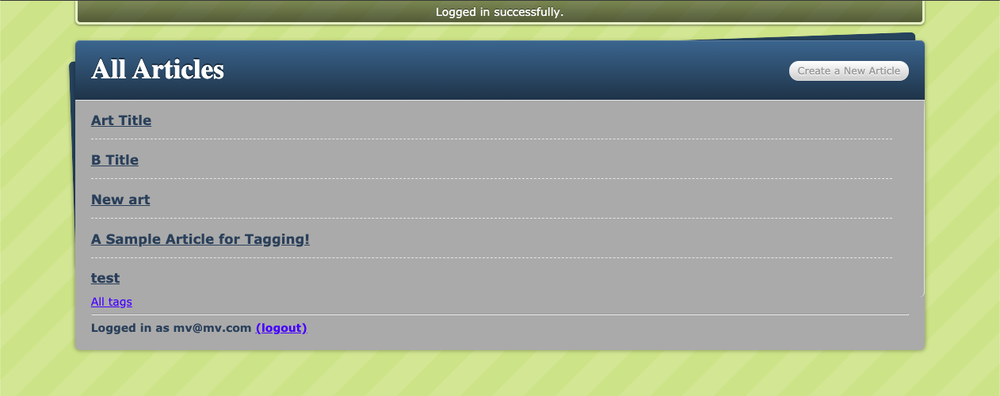

# Project Name

> A blogging application with authentication built with Ruby on Rails.

## Built With

- Ruby
- Ruby on Rails
- Sorcery for Authentication

## Live Demo

[Live Demo Link](https://livedemo.com)

## Getting Started

To get a local copy up and running follow these simple example steps.

### Prerequisites

1. Ruby 2.7
2. Rails 6

### Setup

1. Clone this repository with 
`git clone https://github.com/m15e/rails-blog.git` using your terminal or command line.
2. Change to the project directory by entering `cd rails-blog` in the terminal
3. Next run `bundle install` to install the necessary dependencies 
4. Run `rails db:migrate` to setup your local database.
5. Finally run `rails server` to start the application.
6. Direct your browser to `http://localhost:3000`.

## Authors

👤 **Mark Rode**

- Github: [@m15e](https://github.com/m15e)

👤 **Brandon Defoe**

-  Github: [@defoebrand](https://github.com/defoebrand)
-  LinkedIn: [@defoebrand](https://www.linkedin.com/in/defoebrand/)
-  Gmail: <mailto:defoe.brand@gmail.com>

## Show your support

Give a ⭐️ if you like this project!

## Acknowledgments

- The Odin Project
- Microverse

## 📝 License

This project is [MIT](lic.url) licensed.
